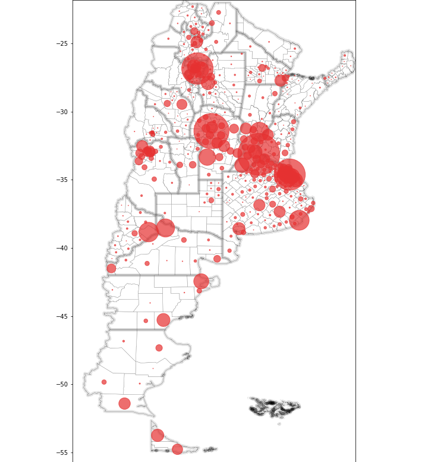
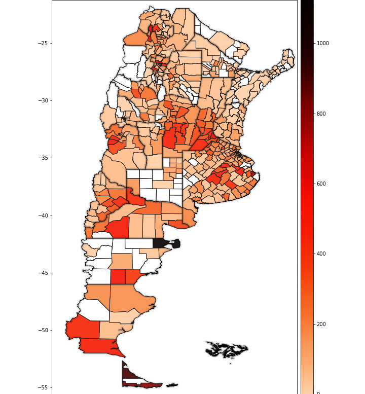
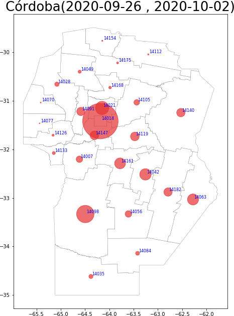
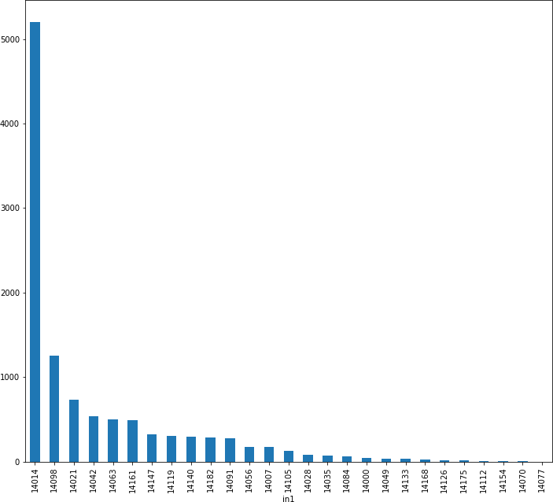
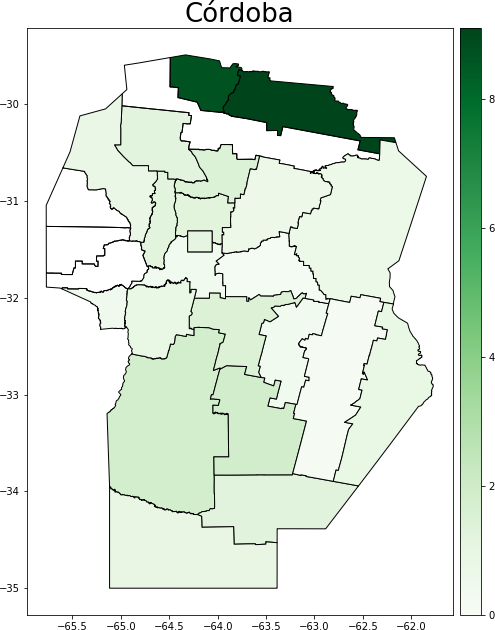

# Departamento de Matemática

# Facultad de Ciencias Exactas, Físico-Químicas y Naturales

# Universidad Nacional de Río Cuarto
<h1> Estadísticas y modelización pandemia  COVID-19 </h1>

<h2> Argentina </h2>
<h3> Casos acumulados por semana </h3>

| Casos Totales | Casos cada 100k |
|-------------- |---------------- |
|                  |          |

<h2> Córdoba </h2>
<h3> Casos acumulados por semana </h3>
||
|

<h3> Letalidad </h3>
Esto es el porcentaje de muestes respecto a la cantidad de infectados

<h2> Modelización </h2>
<h3> Argentina </h3>

<h2> Córdoba </h2>

<h3> Río Cuarto </h3>

<h2> Ciudad Autónoma de Buenos aires </h2>

