**Departamento de Matemática**

**Facultad de Ciencias Exactas, Físico-Químicas y Naturales**

**Universidad Nacional de Río Cuarto**

<h1> Visualización Datos</h1>

<h2> Animaciones </h2>

<h3> Córdoba, casos semanales 01/04/2020-07/12/2020 </h3>

<video width="640" height="480" controls>
 <source src="video/CordobaSemanales.mp4" type="video/mp4">
</video>

<h3> Córdoba, casos acumulados 01/04/2020-07/12/2020 </h3>

<video width="640" height="480" controls>
 <source src="video/CordobaAcumulados.mp4" type="video/mp4">
</video>

<h3> AMBA, casos semanales 01/04/2020-07/12/2020 </h3>

<video width="640" height="480" controls>
 <source src="video/AMBASemanales.mp4" type="video/mp4">
</video>

<h3> Argentina, casos smanales 01/04/2020-07/12/2020 </h3>

<video width="640" height="480" controls>
 <source src="video/ARGSemanales.mp4" type="video/mp4">
</video>

<h3> Argentina casos por millón</h3>
|

<h1> Modelización </h1>

<h2> Argentina </h2>

<h2> Provincias </h2>

1. **Córdoba**
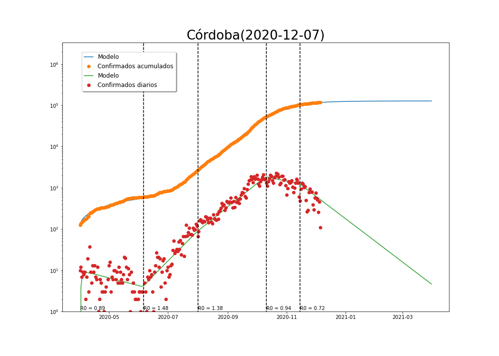

    1. **Calamuchita**
        

    2. **Capital**
        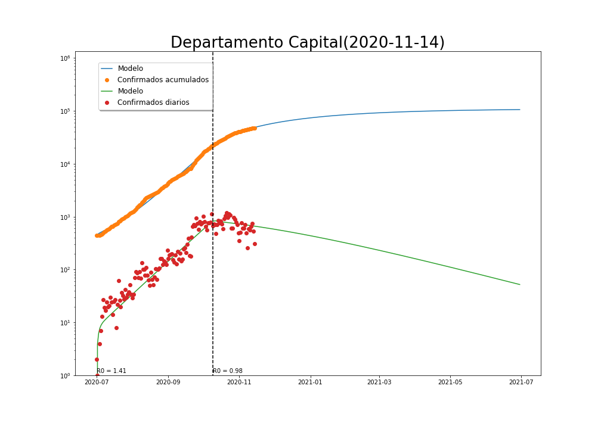

    3. **Gral Roca**
        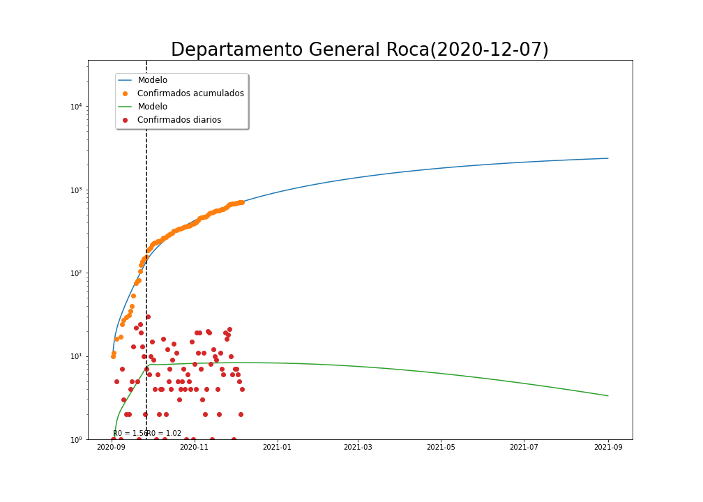

    4. **Gral San Martín**
        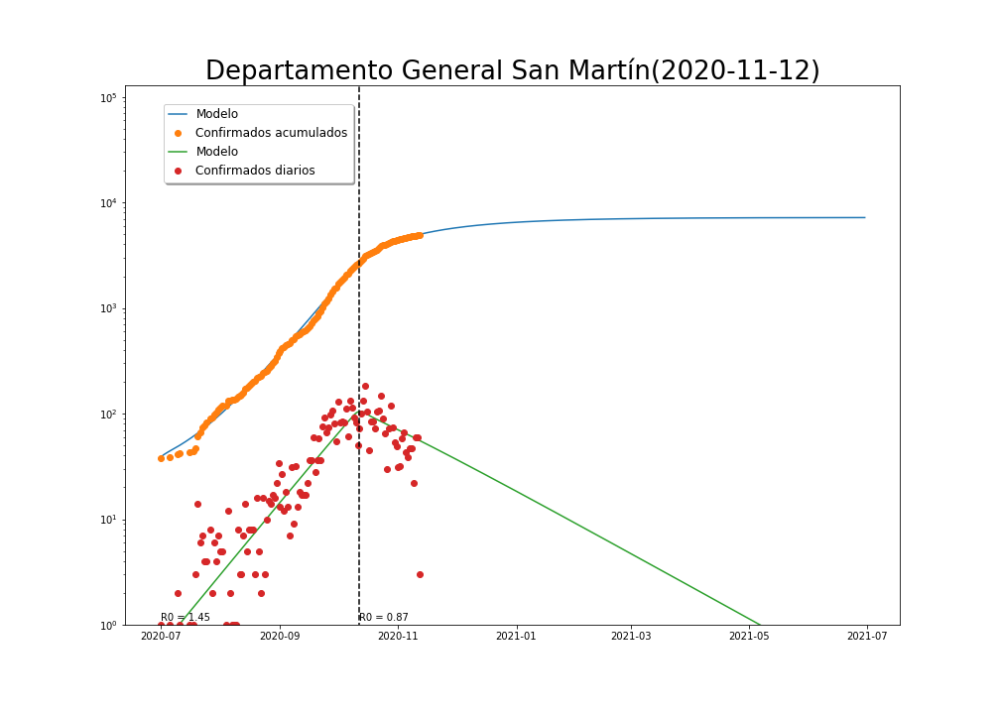

    5. **Juárez Celman**
        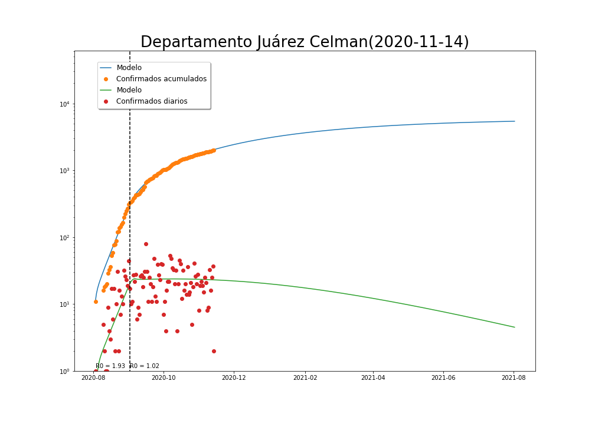

    6. **Marcos Juárez**
        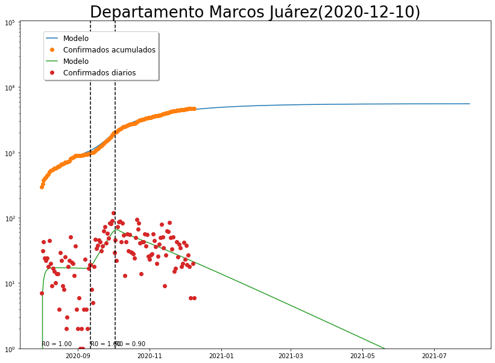

    7. **Río Cuarto**
        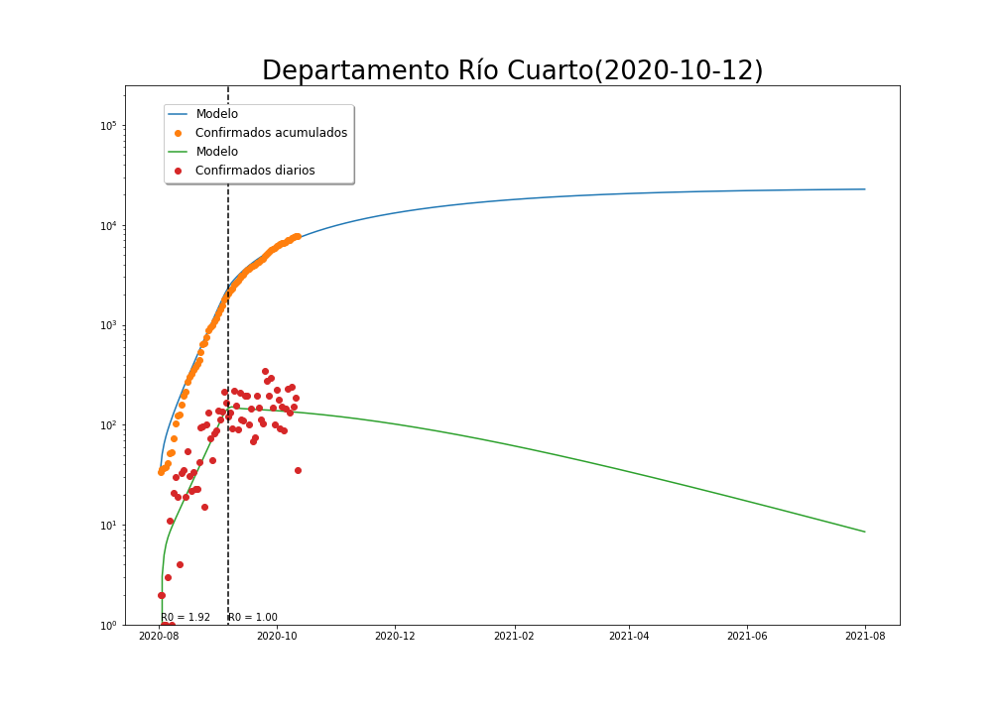

    8. **Presidente Roque Sáenz Peña**
        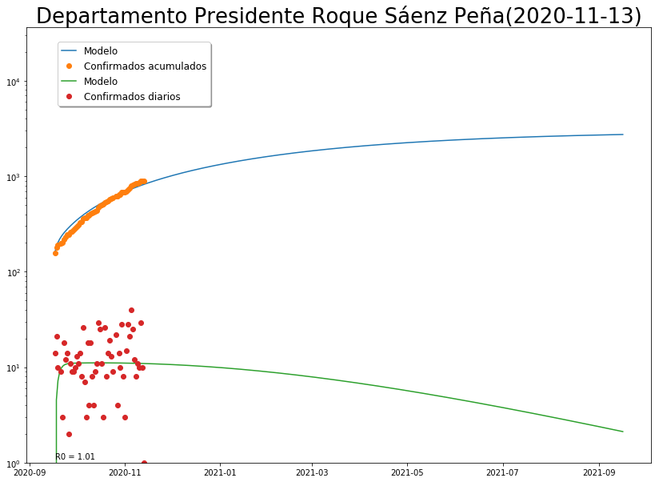

    9. **Tercero Arriba**
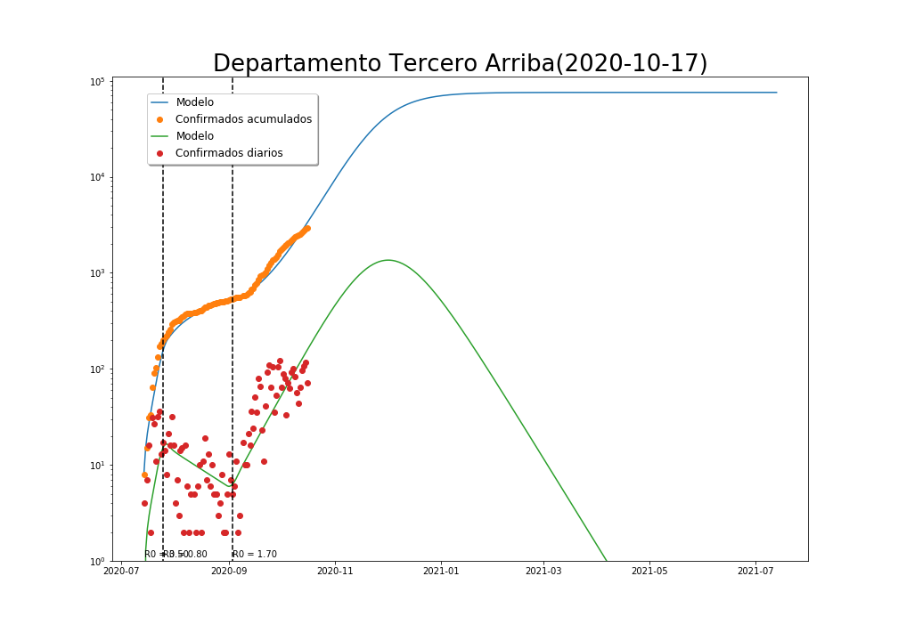

    9. **Unión**
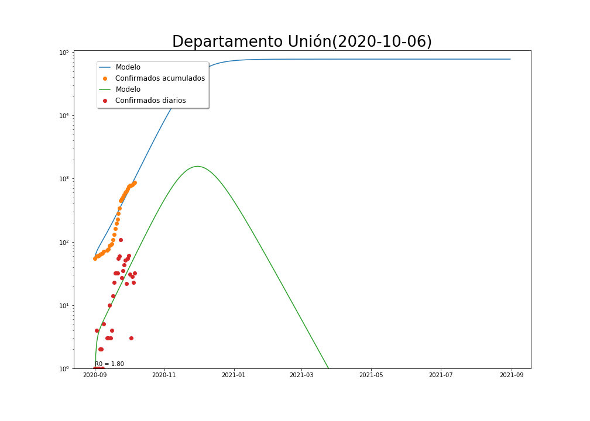

2. **Buenos Aires**
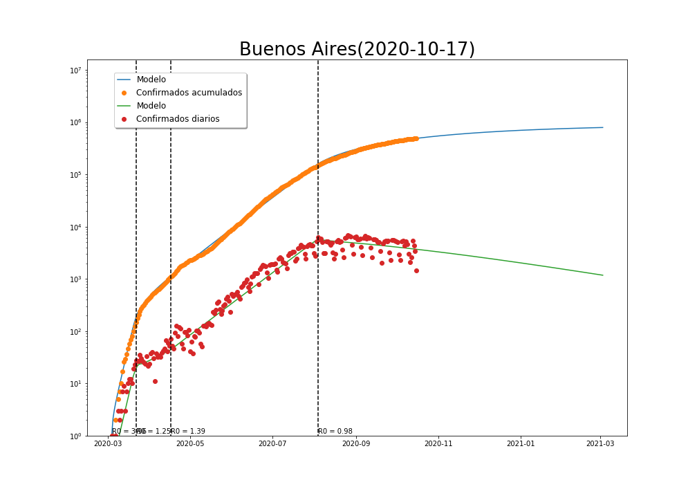

3. **Ciudad Autónoma de Buenos Aires**

4. **Mendoza**

5. **Jujuy**

6. **Santa Fe**
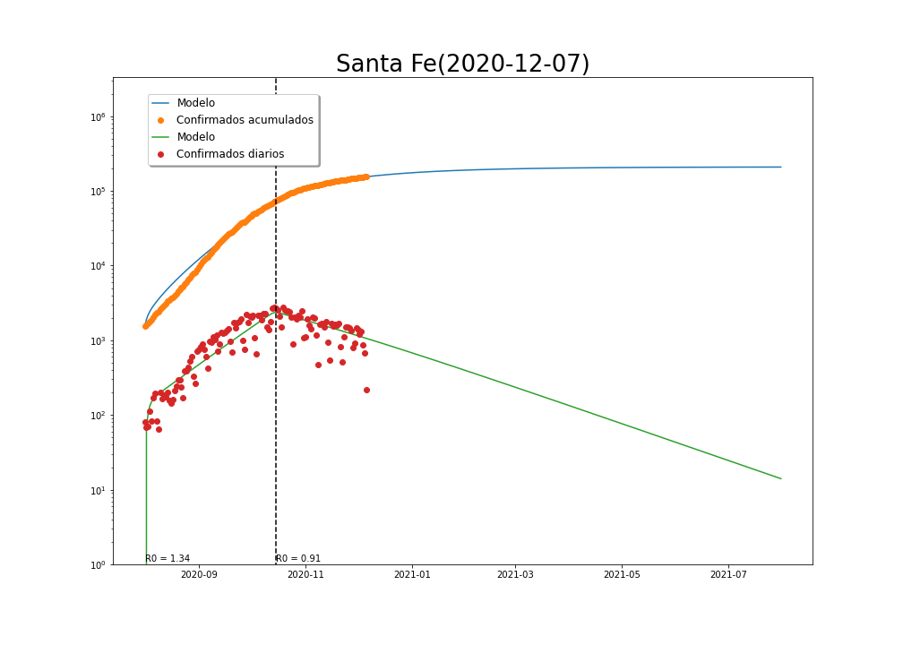

7. **Tucumán**
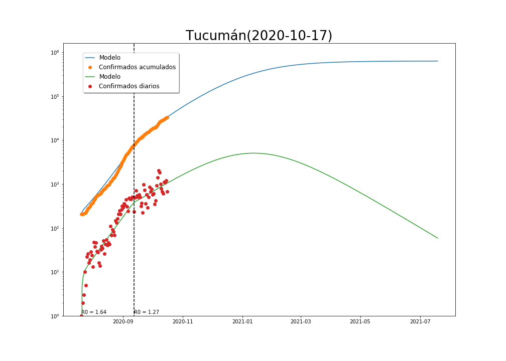

<h2> Brasil </h2>
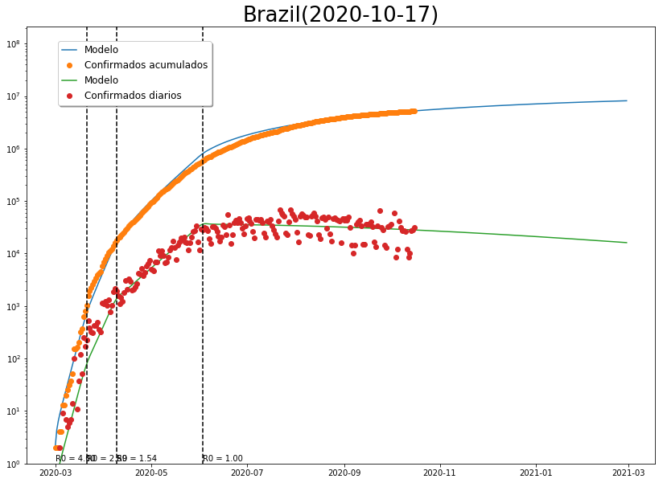

<h2> Italia </h2>
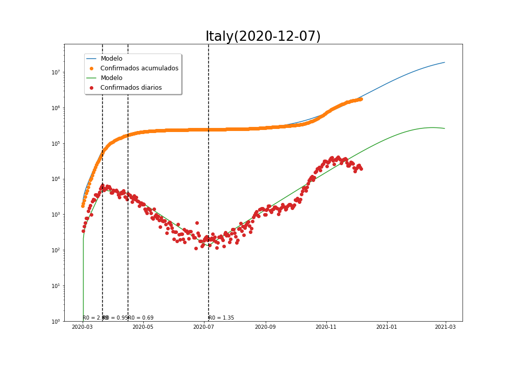
