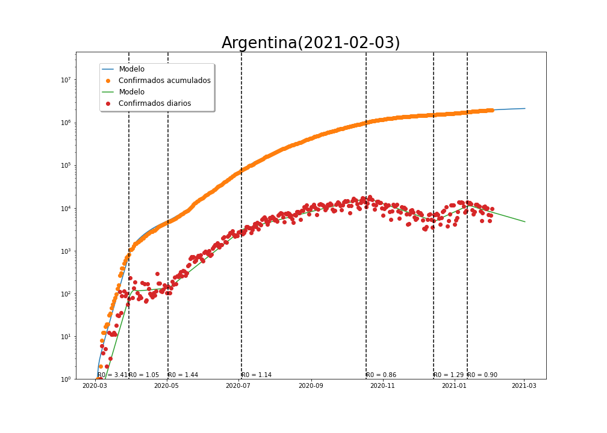
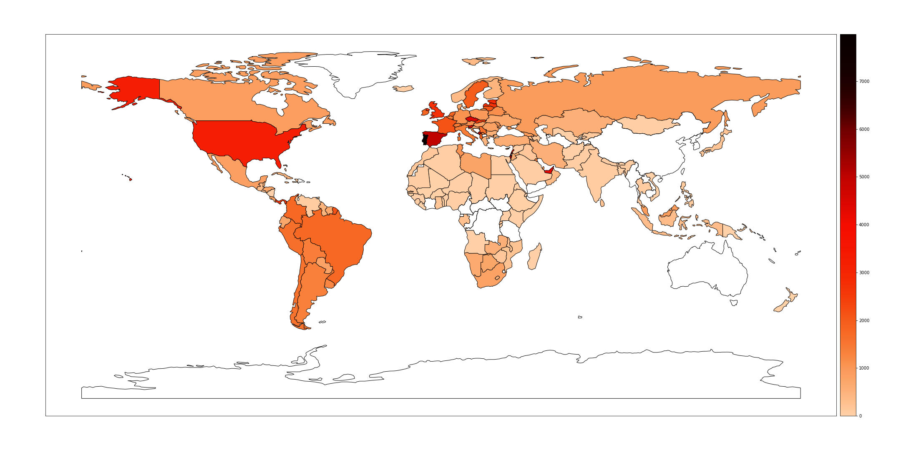

**Departamento de Matemática**

**Facultad de Ciencias Exactas, Físico-Químicas y Naturales**

**Universidad Nacional de Río Cuarto**

<h1> Impacto Global Pandemia COVID-19</h1>

<h2> Casos por millón de habitantes </h2>

La animación muestra los casos por millón de habitantes y por semana desde 22/01/2020 hasta la fecha..

 [<h1>SITUACIÓN EPIDEMIOLÓGICA POR PAISES</h1>](internacionales/README.md)

<h1> Pandemia COVID-19 en Argentina</h1>

**Casos por millón**                |

<h1> [SITUACIÓN EPIDEMIOLÓGICA POR PROVINCIAS](provincias/README.md) </h1>

<h2> Animaciones </h2>

<h3> Córdoba, casos semanales 01/04/2020-30/12/2020 </h3>

<video width="640" height="480" controls>
 <source src="video/CordobaSemanales.mp4" type="video/mp4">
</video>

<h3> AMBA,casos semanales 01/04/2020-30/12/2020 </h3>

<video width="640" height="480" controls>
 <source src="video/AMBASemanales.mp4" type="video/mp4">
</video>

<h3> Argentina </h3>

**Casos semanales 01/04/2020-30/12/2020**  

<video width="440" height="1000" controls><source src="video/ARGSemanales.mp4" type="video/mp4"></video>

<h1> Modelización </h1>

Utilización de un modelo SEIR para estimar la velocidad de propagación de la pandemia y predecir los escenarios futuro. Ver [desripción del modelo](https://github.com/fdmazzone/COVID-19-Mat.UNRC/raw/main/docs/CharlaSEMCOVID.pdf) para más detalles.

<h2> Argentina </h2>

<h2> Provincias </h2>

1. **Córdoba**

[SITUACIÓN EPIDEMIOLÓGICA POR DEPARTAMENTOS](cordoba/README.md)

2. **Buenos Aires**

[SITUACIÓN EPIDEMIOLÓGICA POR PARTIDOS REGIÓN AMBA](amba/README.md)
3. **Ciudad Autónoma de Buenos Aires**

4. **Mendoza**

5. **Jujuy**

6. **Santa Fe**

7. **Tucumán**

7. **La Pampa**

<h1> DATOS INTERNACIONALES </h1>

<h2> Casos acumulados  22/01/2020-30/12/2020 </h2>

<video width="1000" height="700" controls>
 <source src="video/PandeGlobal.mp4" type="video/mp4">
</video>

<h2> Casos por millón de habitantes </h2>

