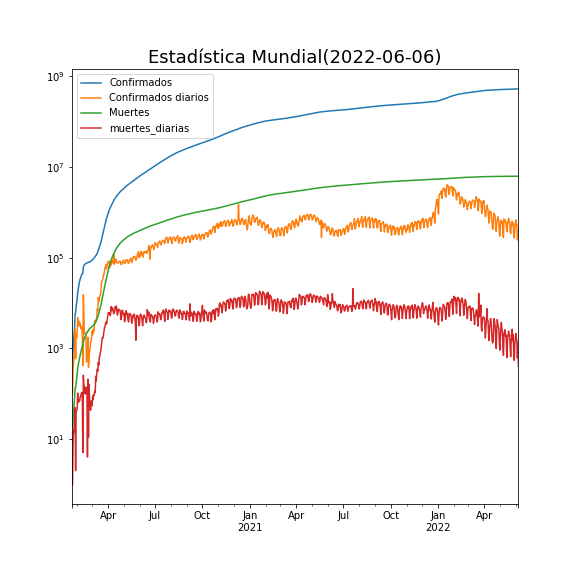
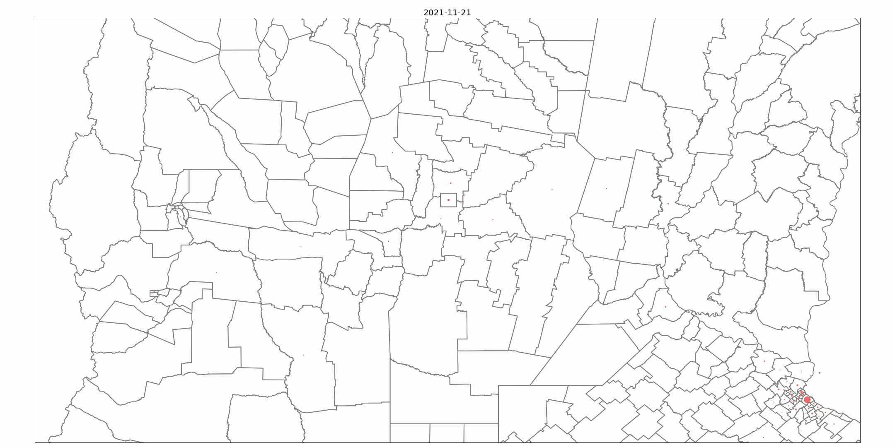

**Departamento de Matemática**

**Facultad de Ciencias Exactas, Físico-Químicas y Naturales**

**Universidad Nacional de Río Cuarto**

<h1> Impacto Global Pandemia COVID-19</h1>

<h2> Casos por millón de habitantes </h2>

La animación muestra los casos por millón de habitantes y por semana desde 22/01/2020 hasta 01/03/2021.

**Para estadísticas por país** [Ir a..](internacionales/README.md)

<h1> Pandemia COVID-19 en Argentina</h1>

<h1> Casos semanales </h1>

<h1>Casos por millón última semana</h1>

**Para estadísticas por provincias** [Ir a..](provincias/README.md)

<h1> Modelización </h1>

**Implementación de modelos matemáticos sobre algiunos distritos y países** [Ir a..](fiteos/README.md)
