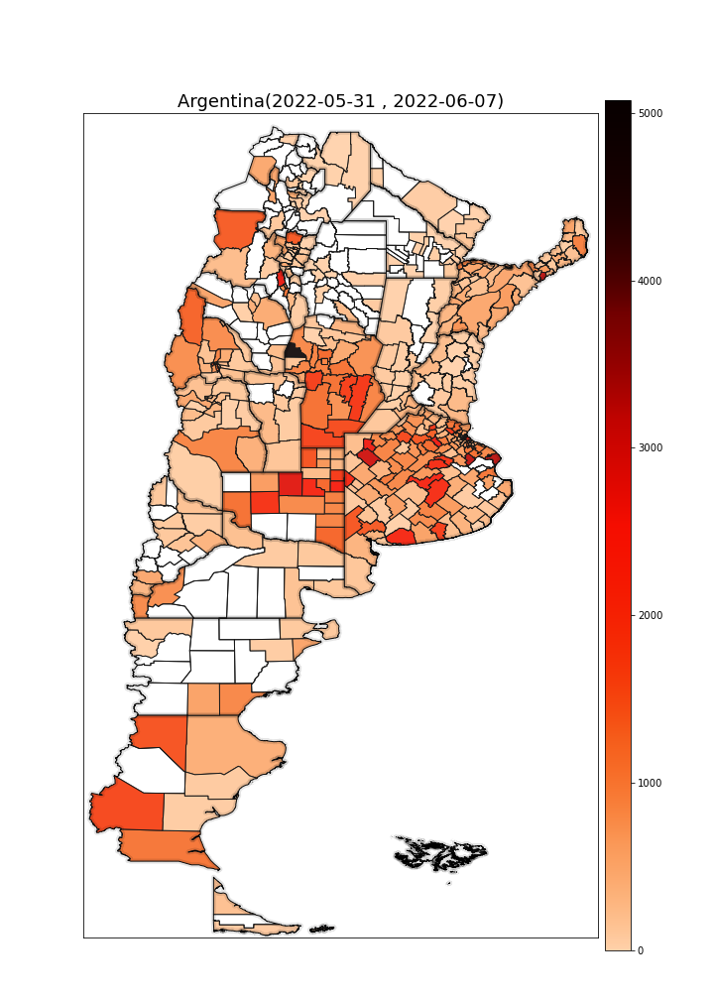
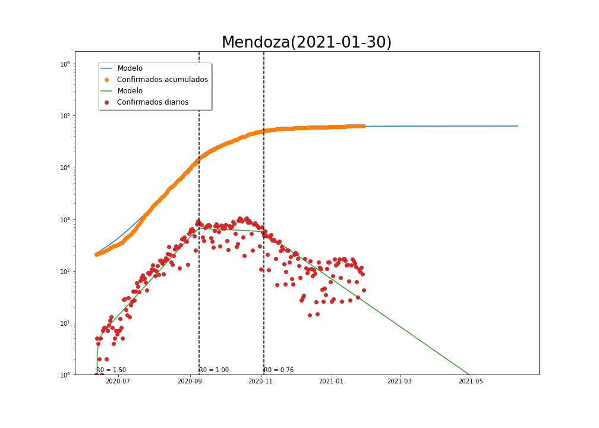

**Departamento de Matemática**

**Facultad de Ciencias Exactas, Físico-Químicas y Naturales**

**Universidad Nacional de Río Cuarto**

<h1> ARGENTINA </h1>

<h2> Animaciones </h2>

<h3> Córdoba, casos semanales 01/04/2020-02/12/2020 </h3>

<video width="640" height="480" controls>
 <source src="video/CordobaSemanales.mp4" type="video/mp4">
</video>

<h3> AMBA,casos semanales 01/04/2020-02/12/2020 </h3>

<video width="640" height="480" controls>
 <source src="video/AMBASemanales.mp4" type="video/mp4">
</video>

<h3> Argentina </h3>

| Casos semanales 01/04/2020-02/12/2020        | Casos por millón              |
| -------------                                | -------------                 |
|<video width="440" height="1000" controls><source src="video/ARGSemanales.mp4" type="video/mp4"></video>||

<h1> Modelización </h1>

Utilización de un modelo SEIR para estimar la velocidad de propagación de la pandemia y predecir los escenarios futuro. Ver [desripción del modelo](https://github.com/fdmazzone/COVID-19-Mat.UNRC/raw/main/doc/CharlaSEMCOVID.pdf) para más detalles.

<h2> Argentina </h2>

<h2> Provincias </h2>

1. **Córdoba**

    1. **Calamuchita**
        

    2. **Capital**
        

    3. **Gral Roca**
        

    4. **Gral San Martín**
        

    5. **Juárez Celman**
        

    6. **Marcos Juárez**
        

    7. **Río Cuarto**
        

    8. **Presidente Roque Sáenz Peña**
        

    9. **Tercero Arriba**

    9. **Unión**

2. **Buenos Aires**

    1. **La Matanza**

    [here](blob/main/amba.md)
[here](https://github.com/fdmazzone/COVID-19-Mat.UNRC/blob/master/amba.md) 

3. **Ciudad Autónoma de Buenos Aires**

4. **Mendoza**

5. **Jujuy**

6. **Santa Fe**

7. **Tucumán**

<h1> DATOS INTERNACIONALES </h1>

<h2> Casos acumulados  22/01/2020-12/12/2020 </h2>

<video width="1000" height="700" controls>
 <source src="video/PandeGlobal.mp4" type="video/mp4">
</video>

<h2> Casos por millón de habitantes </h2>

<h2> América del Sur </h2>

|----------|----------|
|||
|||
|||
|||
|||

<h2> América Central </h2>

|----------|----------|
|||
|||
|||

<h2> Caribe </h2>

|----------|----------|
|||
|||

<h2> América del Norte </h2>

|----------|----------|
|||
|||

<h2> Europa </h2>

|----------|----------|
|||
|||
|||
|||
|||
|||
|||
|||
|||

<h2> Asia</h2>

|----------|----------|
|||
|||
|||
|||
