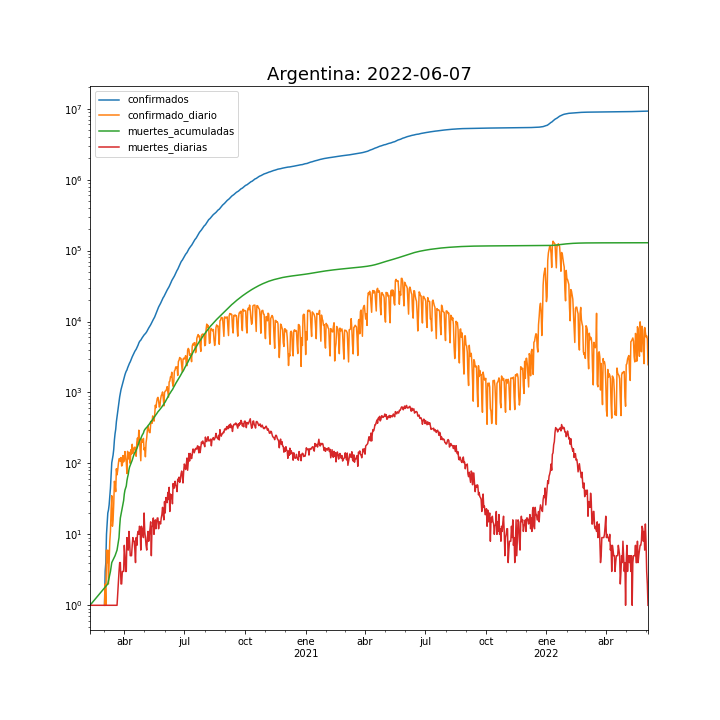

<h1> Impacto Global Pandemia COVID-19</h1>

* [ Estadísticas por País  ](internacionales/README.md)

<h2> Casos por millón de habitantes </h2>

La animación muestra los casos por millón de habitantes y por semana desde 22/01/2020 hasta 23/12/2021.

<h1> Pandemia COVID-19 en Argentina</h1>

* [ Estadísticas por Provincia  ](provincias/README.md)

<h1> Casos semanales </h1>

<h1>Casos por millón última semana</h1>

<h1>Casos diarios, internaciones, asistencia respiratoria, muertes</h1>

||

<h1> Modelización </h1>

[ Modelización Matemática   ](fiteos/README.md)
