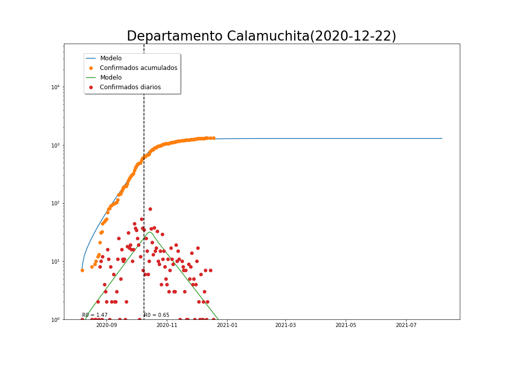
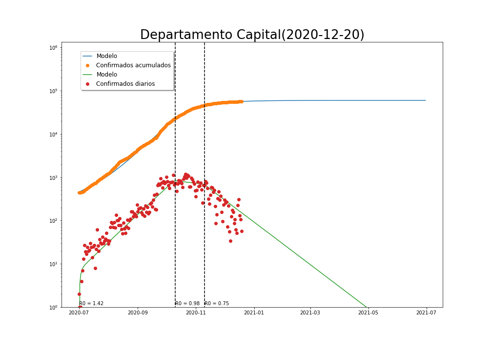
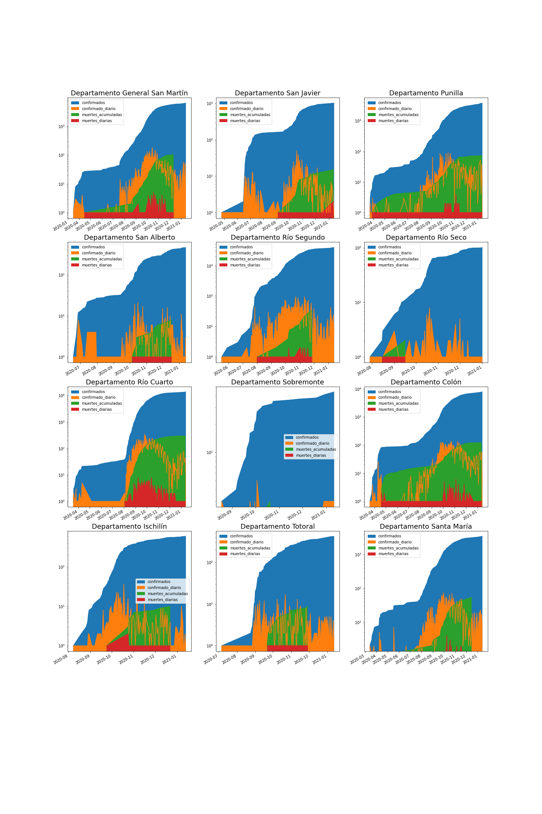
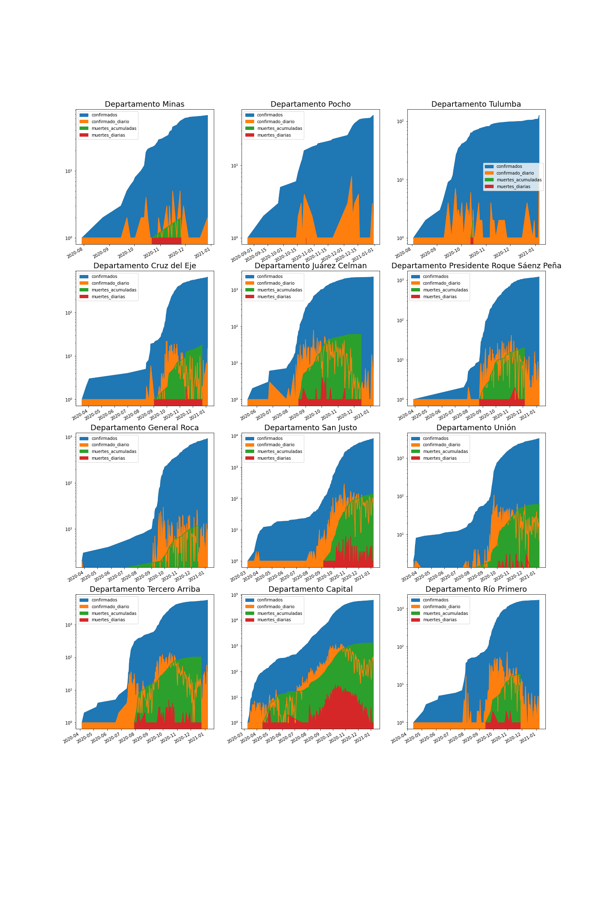

<h1> IMPACTO PANDEMIA POR DEPARTAMENTOS, MODELIZACIÓN </h1>

<h2>Calamuchita</h2>

<h2>Capital</h2>

<h2>Gral Roca</h2>

<h2>Gral San Martín</h2>

<h2>Juárez Celman</h2>

<h2>Marcos Juárez</h2>

<h2>Río Cuarto</h2>

<h2>Presidente Roque Sáenz Peña</h2>

<h2>Tercero Arriba</h2>

<h2>Unión</h2>

<h1> IMPACTO PANDEMIA POR DEPARTAMENTOS, Estadística general</h1>

