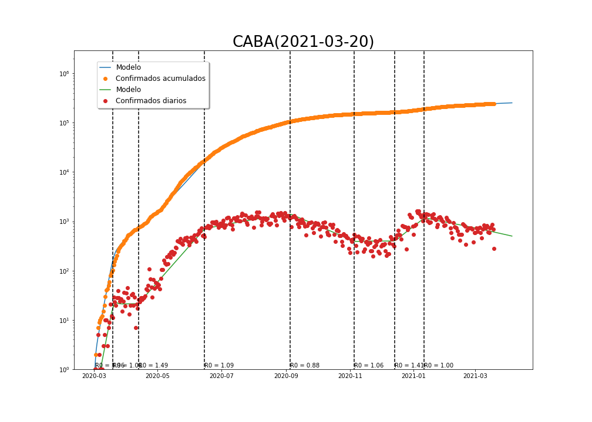
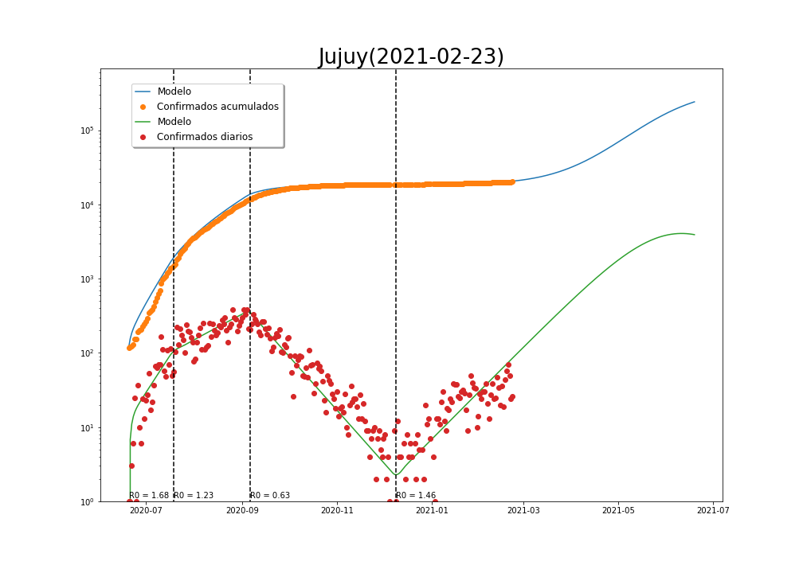

Utilización de un modelo SEIR para estimar la velocidad de propagación de la pandemia y predecir los escenarios futuro. Ver [desripción del modelo](https://github.com/fdmazzone/COVID-19-Mat.UNRC/raw/main/docs/CharlaSEMCOVID.pdf) para más detalles.

<h1> Argentina </h1>

<h1> Provincias </h1>

1. **Córdoba**

[SITUACIÓN EPIDEMIOLÓGICA POR DEPARTAMENTOS](cordoba/README.md)

2. **Buenos Aires**

[SITUACIÓN EPIDEMIOLÓGICA POR PARTIDOS](amba/README.md)

3. **Ciudad Autónoma de Buenos Aires**

4. **Mendoza**

5. **Jujuy**

6. **Santa Fe**

7. **Tucumán**

7. **La Pampa**

<h1> Brasil </h1>

