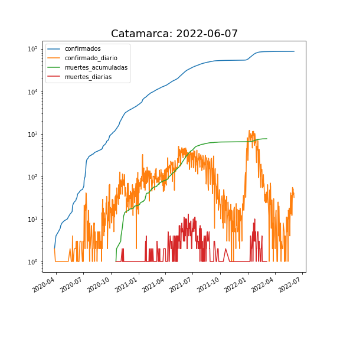
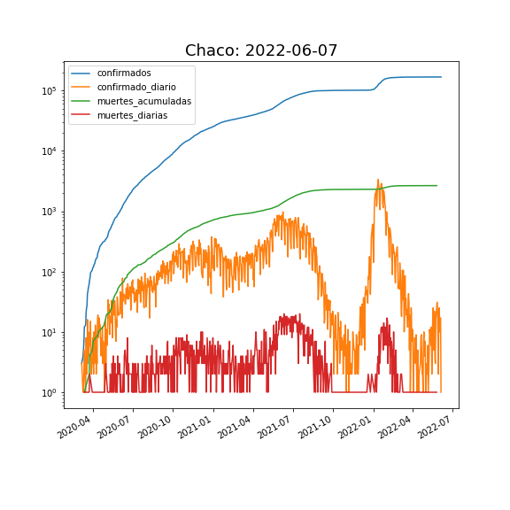
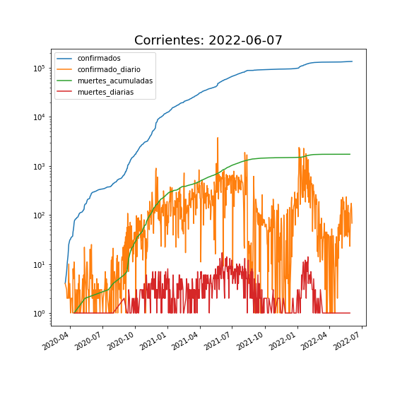
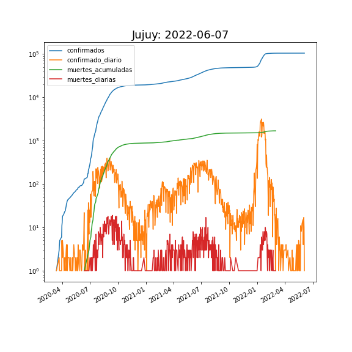
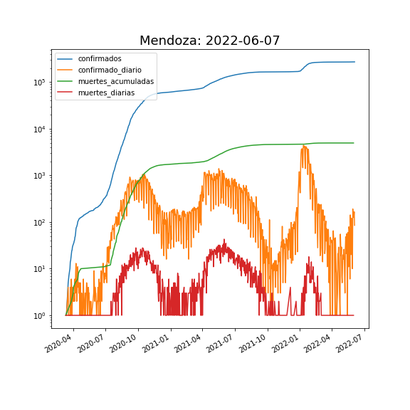
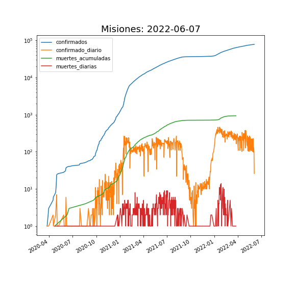
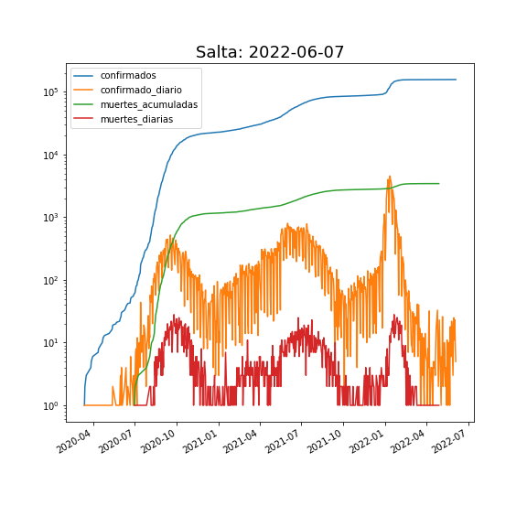

* [ CÓRDOBA: SITUACIÓN EPIDEMIOLÓGICA POR DEPARTAMENTO  ](cordoba/README.md)

* [ AMBA: SITUACIÓN EPIDEMIOLÓGICA POR PARTIDO ](amba/README.md)

<h1> Situación Epidemiológica por Provincias </h1>

|----------|----------|
|||
|||
|||
|||
|||
|||
|||
|||
|||
|||
|||
|||
