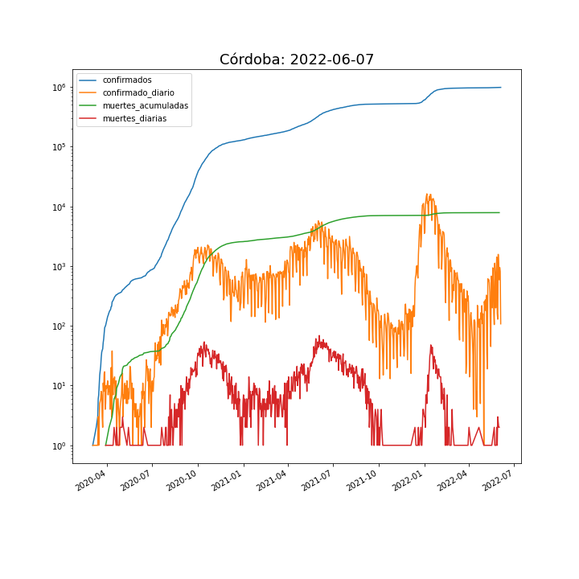
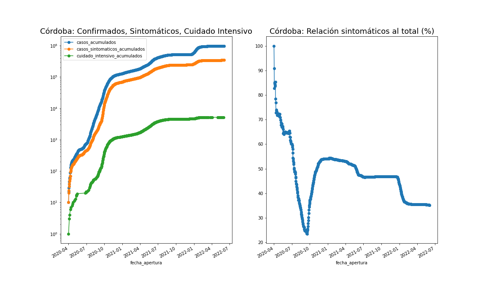
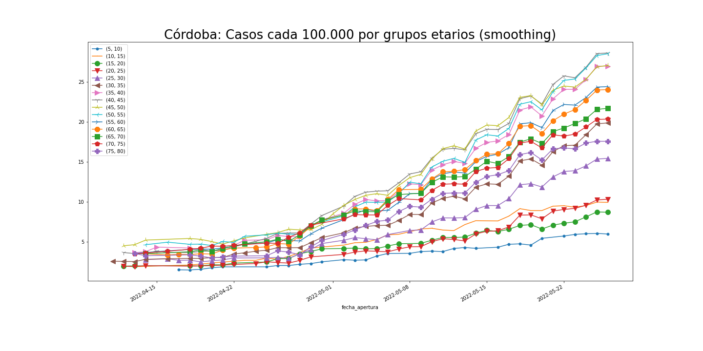

<h1> Animación: Córdoba, casos semanales 01/04/2020-23/12/2021 </h1>

<h1> Casos, internaciones, respirador, muertes</h1>

<h1> Evolución de casos asintomáticos detectados</h1>

<h1> Casos por grupo etarios cada 100.000 habitates</h1>

<h1> IMPACTO PANDEMIA POR DEPARTAMENTOS, Estadística general</h1>

